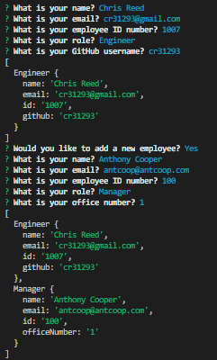
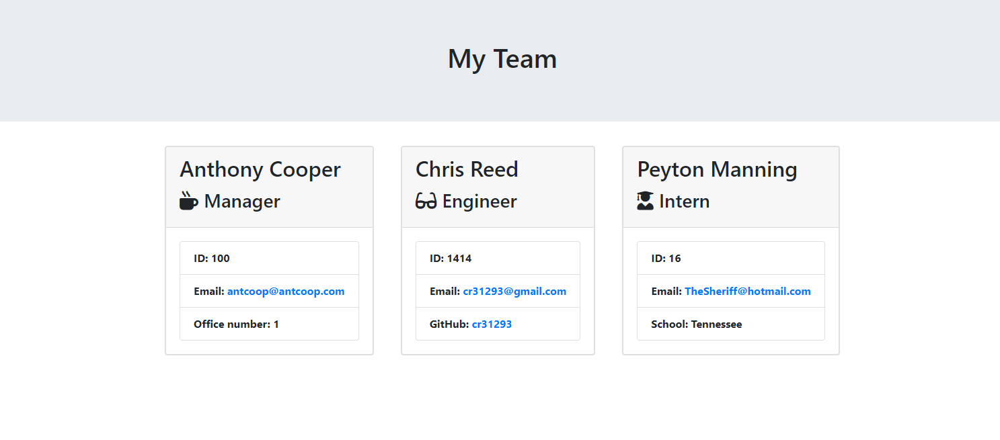

# Template-Engine

 

## Description
This is a CLI application that allows the user to build out a Team page showing their team members and relevant information such as Employee #, Email, GitHub Profile, ect. Currently this application is able to account for manager, engineer, and intern team members.

 

## Installation
This application can be found and installed at https://github.com/cr31293/Template-Engine.

 

## Usage
Creating your team dashboard is fully handling through the command line. An instructional walkthrough on creating your dashboard may be found at https://drive.google.com/file/d/1kaQJc8B91hEKHVIRfv_5nAEMWA8X8duu/view

## Images

 

 
 

## Contributions
Authored by Chris Reed. This application relies heavily on npm inquirer for functionality. Common methods used in this package are found at https://www.npmjs.com/package/inquirer#methods 

 
 

## Licensing
MIT License

Copyright (c) 2020 Chris Reed

Permission is hereby granted, free of charge, to any person obtaining a copy
of this software and associated documentation files (the "Software"), to deal
in the Software without restriction, including without limitation the rights
to use, copy, modify, merge, publish, distribute, sublicense, and/or sell
copies of the Software, and to permit persons to whom the Software is
furnished to do so, subject to the following conditions:

The above copyright notice and this permission notice shall be included in all
copies or substantial portions of the Software.

THE SOFTWARE IS PROVIDED "AS IS", WITHOUT WARRANTY OF ANY KIND, EXPRESS OR
IMPLIED, INCLUDING BUT NOT LIMITED TO THE WARRANTIES OF MERCHANTABILITY,
FITNESS FOR A PARTICULAR PURPOSE AND NONINFRINGEMENT. IN NO EVENT SHALL THE
AUTHORS OR COPYRIGHT HOLDERS BE LIABLE FOR ANY CLAIM, DAMAGES OR OTHER
LIABILITY, WHETHER IN AN ACTION OF CONTRACT, TORT OR OTHERWISE, ARISING FROM,
OUT OF OR IN CONNECTION WITH THE SOFTWARE OR THE USE OR OTHER DEALINGS IN THE
SOFTWARE.
